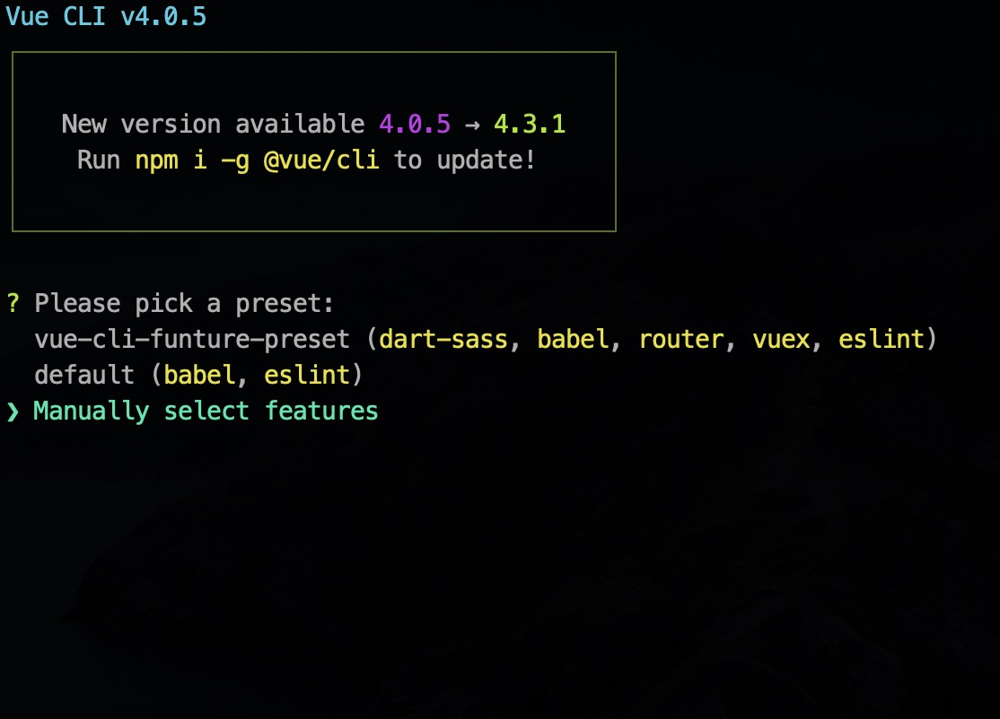
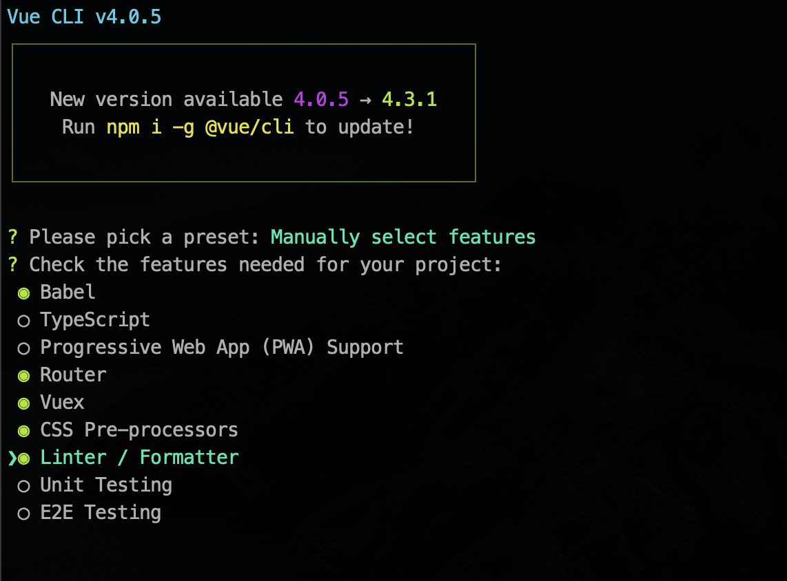
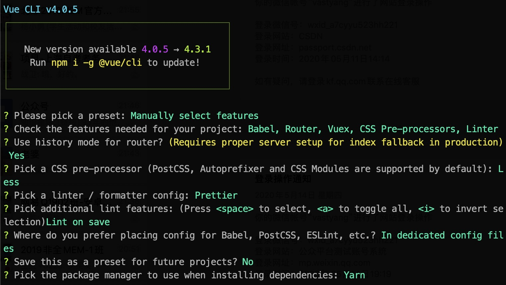
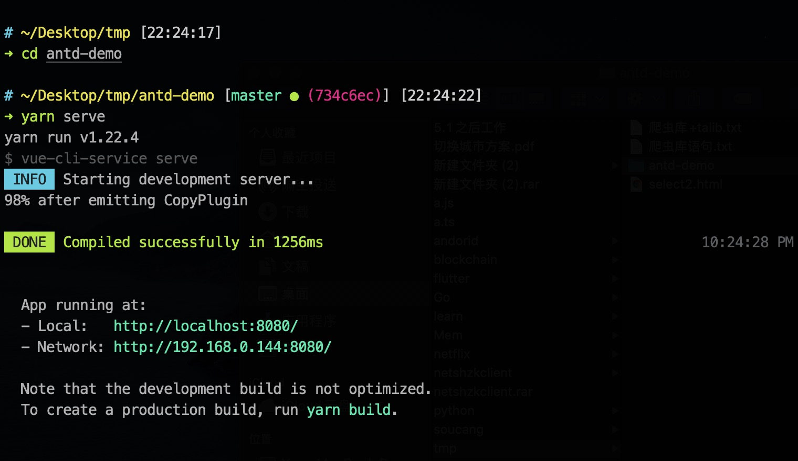
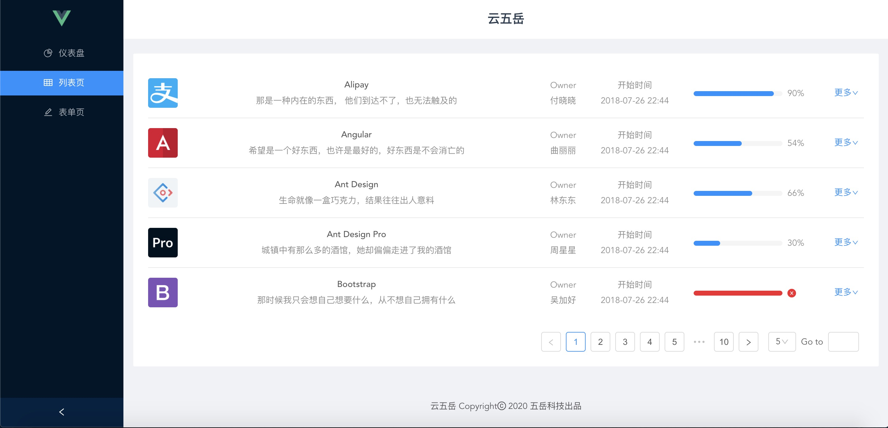

# antd-demo

Vue 结合 Ant Design Vue 的示例工程

### 前置工具

##### 1. [安装 Node](http://jianshu.com)

##### 2. 全局安装 yarn 依赖管理工具

```
npm install -g yarn
```

### 创建步骤

#### 1. 安装脚手架工具

```
npm install -g @vue/cli
```

#### 2. 创建项目

```
vue create antd-demo
```

##### step1：按上下键选择 Manually select features



##### step2：按上下键选择要安装的功能，按空格键确定，选择完成之后回车进行下一步



##### step3：同理完成接下来的配置



##### step4：运行项目成功后，在浏览器输入地址即可预览

http://localhost:8080/



### 引入 antd

##### 安装 ant-design-vue

```
yarn add ant-design-vue
```

##### 安装 babel-plugin-import

```
yarn add babel-plugin-import --dev
```

##### 修改 babel.config.js

```
module.exports = {
  presets: ["@vue/cli-plugin-babel/preset"],
  plugins: [
    [
      "import",
      { libraryName: "ant-design-vue", libraryDirectory: "es", style: true }
    ]
  ]
};
```

##### main.js 文件引入 antd-vue,引入后如下

```
import Vue from "vue";
import App from "./App.vue";
import router from "./router";
import store from "./store";
import { Button } from "ant-design-vue";

Vue.use(Button);
Vue.config.productionTip = false;

new Vue({
  router,
  store,
  render: h => h(App)
}).$mount("#app");
```

##### 运行项目，可能出现 less 问题，解决方案见下方，然后重新运行项目

```
yarn serve
```


> 解决办法根目录下新建 vue.config.js

```
module.exports = {
  css: {
    loaderOptions: {
      less: {
        javascriptEnabled: true
      }
    }
  }
};
```

### 项目改造
先预安装数据图表插件
```
yarn add viser-vue
```

##### 1. 修改 src/App.vue

```
<template>
  <div id="app">
    <router-view />
  </div>
</template>

<style lang="less">
#app {
  font-family: Avenir, Helvetica, Arial, sans-serif;
  -webkit-font-smoothing: antialiased;
  -moz-osx-font-smoothing: grayscale;
  text-align: center;
  color: #2c3e50;
}
</style>
```

##### 2. 修改 src/main.js

```
import Vue from "vue";
import App from "./App.vue";
import router from "./router";
import store from "./store";
import Viser from "viser-vue";
import { Layout } from "ant-design-vue";
import { Menu } from "ant-design-vue";
import { Icon } from "ant-design-vue";
import { Card } from "ant-design-vue";
import { List } from "ant-design-vue";
import { Avatar } from "ant-design-vue";
import { Dropdown } from "ant-design-vue";
import { Progress } from "ant-design-vue";
import { Form } from "ant-design-vue";
import { Button } from "ant-design-vue";
import { Input } from "ant-design-vue";
import { InputNumber } from "ant-design-vue";
import { DatePicker } from "ant-design-vue";
import { TimePicker } from "ant-design-vue";
import { Radio } from "ant-design-vue";
import { Select } from "ant-design-vue";
import { Row } from "ant-design-vue";
import { Col } from "ant-design-vue";
import { Tabs } from "ant-design-vue";

Vue.use(Tabs);
Vue.use(Col);
Vue.use(Row);
Vue.use(Select);
Vue.use(Radio);
Vue.use(DatePicker);
Vue.use(TimePicker);
Vue.use(Input);
Vue.use(InputNumber);
Vue.use(Button);
Vue.use(Form);
Vue.use(Progress);
Vue.use(Dropdown);
Vue.use(Avatar);
Vue.use(List);
Vue.use(Card);
Vue.use(Icon);
Vue.use(Menu, Menu.SubMenu);
Vue.use(Layout, Layout.Header, Layout.Content, Layout.Footer, Layout.Sider);
Vue.use(Viser);

Vue.config.productionTip = false;

new Vue({
  router,
  store,
  render: h => h(App)
}).$mount("#app");
```

##### 3. 新建 src/layouts 目录，并在目录下新建 BasicLayout.vue 文件

```
<template>
  <a-layout id="components-layout-demo-side" style="min-height: 100vh">
    <a-layout-sider v-model="collapsed" collapsible>
      <div class="logo">
        
      </div>
      <!-- 左侧菜单 -->
      <a-menu
        theme="dark"
        :default-selected-keys="['1']"
        :selected-keys="[current]"
        mode="inline"
        @click="menuClick"
      >
        <a-menu-item key="1">
          <a-icon type="pie-chart" />
          <span>仪表盘</span>
        </a-menu-item>
        <a-menu-item key="2">
          <a-icon type="table" />
          <span>列表页</span>
        </a-menu-item>
        <a-menu-item key="3">
          <a-icon type="edit" />
          <span>表单页</span>
        </a-menu-item>
      </a-menu>
    </a-layout-sider>
    <!-- 右侧布局 -->
    <a-layout>
      <!-- 右侧header -->
      <a-layout-header style="background: #fff; padding: 0">
        <div class="title">云五岳</div>
      </a-layout-header>

      <!-- 右侧content -->
      <a-layout-content style="margin: 0 16px">
        <!-- 路由中子组件在这里渲染 -->
        <router-view></router-view>
      </a-layout-content>

      <!-- 右侧footer -->
      <a-layout-footer style="text-align: center">
        云五岳 Copyright<a-icon type="copyright" /> 2020
        <span>五岳科技出品</span>
      </a-layout-footer>
    </a-layout>
  </a-layout>
</template>
<script>
export default {
  data() {
    return {
      collapsed: false,
      current: "1"
    };
  },
  methods: {
    menuClick(e) {
      this.current = e.key;
      if (e.key == "1") {
        this.$router.push({ path: "/dashboard/analysis" });
      } else if (e.key == "2") {
        this.$router.push({ path: "/list/basic-list" });
      } else if (e.key == "3") {
        this.$router.push({ path: "/form/basic-form" });
      }
    }
  },
  mounted() {
    let path = this.$route.path;
    console.log(path);
    if (path.indexOf("/dashboard") != -1) {
      this.current = "1";
    } else if (path.indexOf("/list") != -1) {
      this.current = "2";
    } else if (path.indexOf("/form") != -1) {
      this.current = "3";
    }
  }
};
</script>

<style>
#components-layout-demo-side .logo {
  height: 32px;
  margin: 16px;
}
.logo-img {
  width: 30px;
}
.title {
  font-size: 20px;
  font-weight: 600;
}
</style>
```

##### 4. 将原先的路由文件 router/index.js 修改如下

```
import Vue from "vue";
import VueRouter from "vue-router";

Vue.use(VueRouter);

const routes = [
  {
    path: "/",
    component: () =>
      import(/* webpackChunkName: "layout" */ "../layouts/BasicLayout"),
    children: [
      // dashboard
      {
        path: "/",
        redirect: "/dashboard/analysis"
      },
      {
        path: "/dashboard",
        name: "dashboard",
        redirect: "/dashboard/analysis",
        meta: { icon: "dashboard", title: "仪表盘" },
        component: { render: h => h("router-view") },
        children: [
          {
            path: "analysis",
            name: "Analysis",
            meta: { title: "分析页" },
            component: () =>
              import(
                /* webpackChunkName: "dashboard" */ "../views/dashboard/Analysis"
              )
          }
        ]
      },
      // list
      {
        path: "/list",
        name: "list",
        redirect: "/list/basic-list",
        component: { render: h => h("router-view") },
        meta: { title: "列表页", icon: "table", permission: ["table"] },
        children: [
          {
            path: "basic-list",
            name: "BasicList",
            component: () => import("@/views/list/BasicList"),
            meta: { title: "标准列表", keepAlive: true, permission: ["table"] }
          }
        ]
      },
      // forms
      {
        path: "/form",
        name: "form",
        redirect: "/form/basic-form",
        component: { render: h => h("router-view") },
        meta: { title: "表单页", icon: "form", permission: ["form"] },
        children: [
          {
            path: "basic-form",
            name: "BasicForm",
            component: () => import("@/views/form/BasicForm"),
            meta: { title: "基础表单", keepAlive: true, permission: ["form"] }
          }
        ]
      }
    ]
  }
];

const router = new VueRouter({
  mode: "history",
  base: process.env.BASE_URL,
  routes
});

export default router;
```

##### 5. 然后在 views 目录下新建路由中对应的子目录和页面

```
views
    ├── dashboard
    │   └── Analysis.vue
    ├── form
    │   └── BaseForm.vue
    └── list
        └── BaseList.vue
```

##### 6. `yarn serve` 预览效果



### 官方管理后台模版

[ant-design-pro](https://github.com/ant-design/ant-design-pro)

##### 项目下载和运行

- 拉取项目代码

```bash
git clone https://github.com/sendya/ant-design-pro-vue.git
cd ant-design-pro-vue
```

- 安装依赖

```
yarn install
```

- 开发模式运行

```
yarn run serve
```

- 编译项目

```
yarn run build
```

- Lints and fixes files

```
yarn run lint
```

### VSCode 配置

[插件安装推荐博文](https://liubing.me/vscode-vue-setting.html)

##### 仅供参考的settings.json

```
"minapp-vscode.disableAutoConfig": true,

// editor配置
"editor.tabCompletion": "onlySnippets",
"editor.renderWhitespace": "all",
"editor.defaultFormatter": "esbenp.prettier-vscode",
"editor.tabSize": 2,
"editor.formatOnSave": true,
"editor.codeActionsOnSave": {
  "source.fixAll.eslint": true
},
// eslint配置
"eslint.enable": false,
"eslint.alwaysShowStatus": true,
"eslint.validate": [
  "javascript",
  "javascriptreact",
  "html",
  "vue"
],
// prettier配置
"prettier.arrowParens": "avoid",
"prettier.trailingComma": "none"
```

### 附录

- See [vue-cli](https://cli.vuejs.org/)
- See [vue router](https://router.vuejs.org/)
- See [vuex](https://vuex.vuejs.org/)
- See [vue-devtools](https://github.com/vuejs/vue-devtools#vue-devtools)
- See [awesome-vue](https://github.com/vuejs/awesome-vue)
